## Podcast client to listen to all you favorite podcasts

  

# New episodes
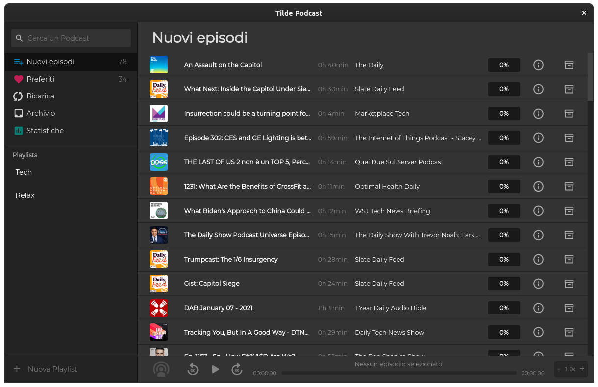
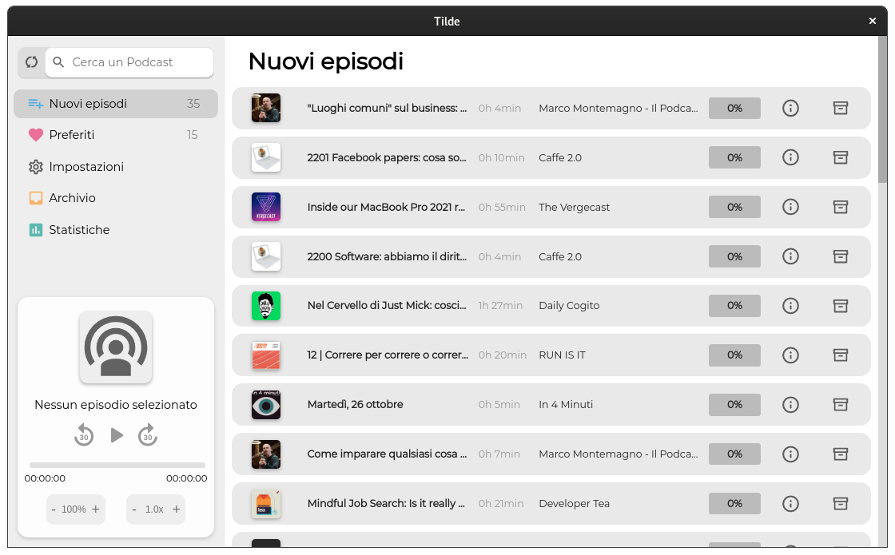

# Favorites
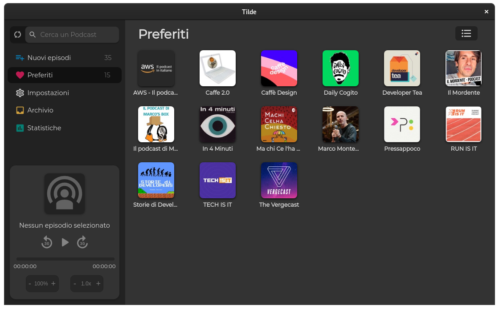
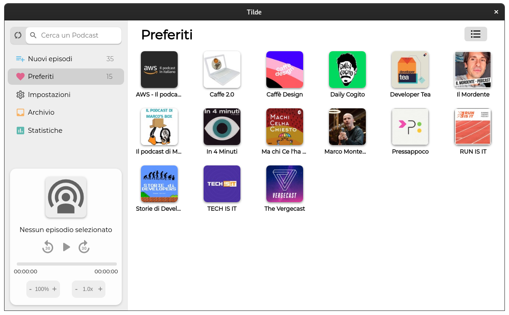

# Archive
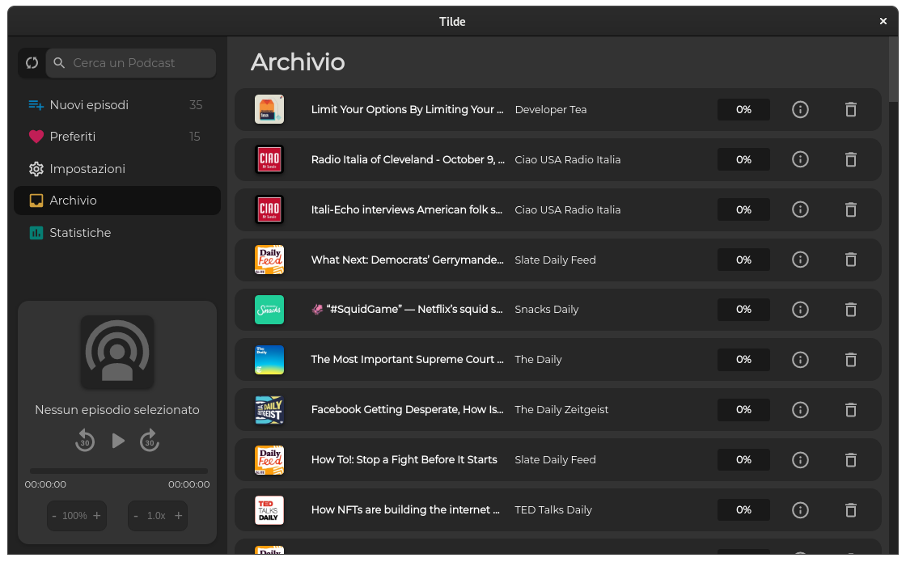
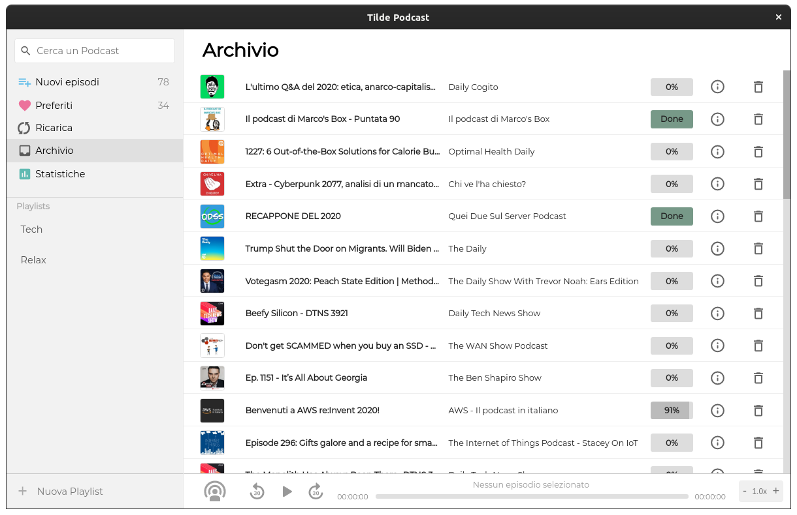

# Statistics
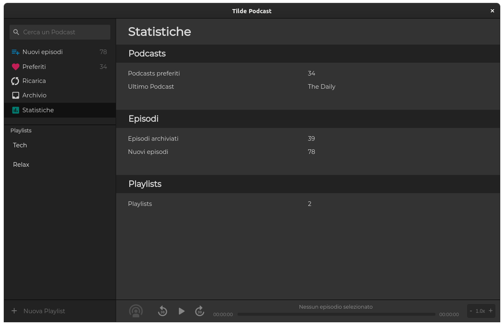
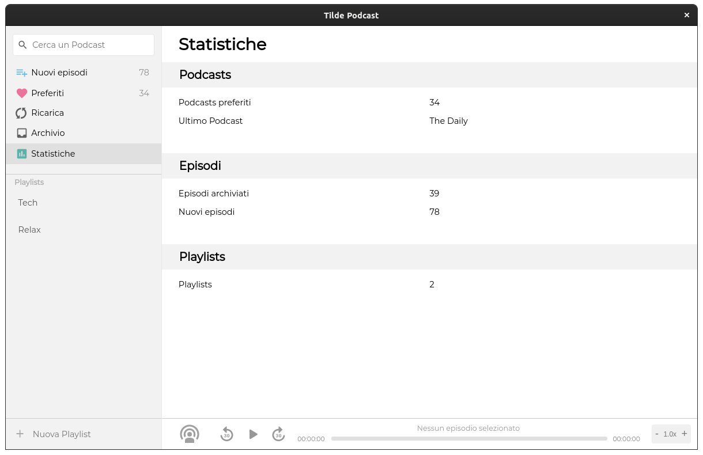

# Show podcasts
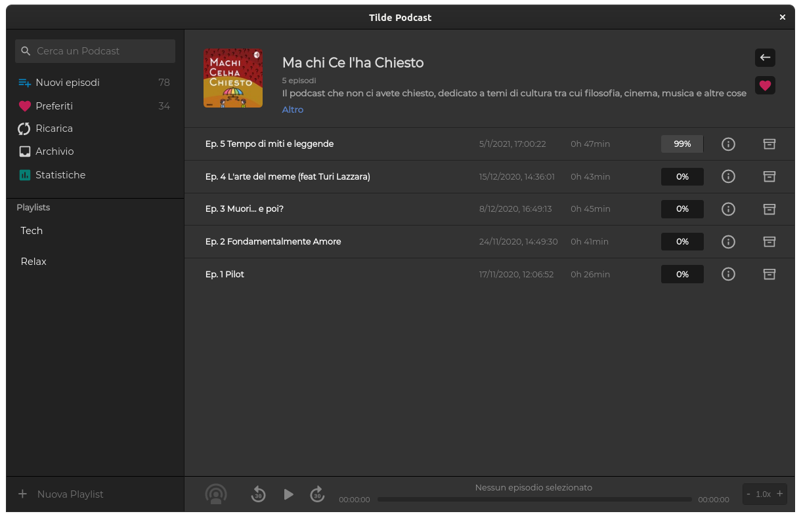
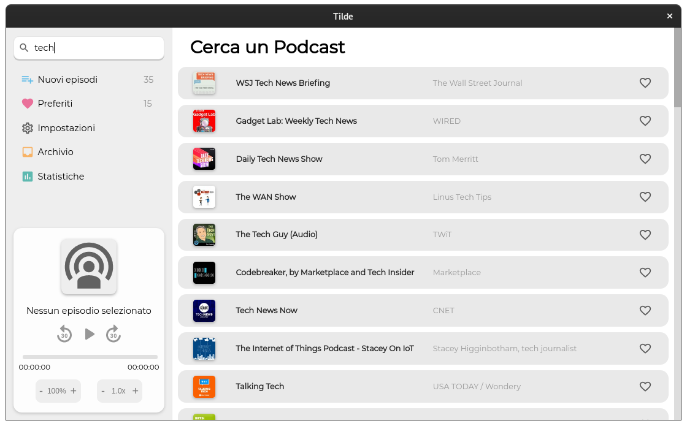

# Search for new podcasts via the itunes api
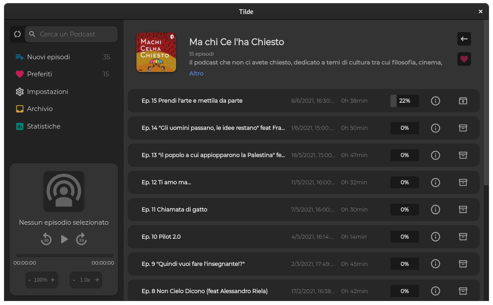
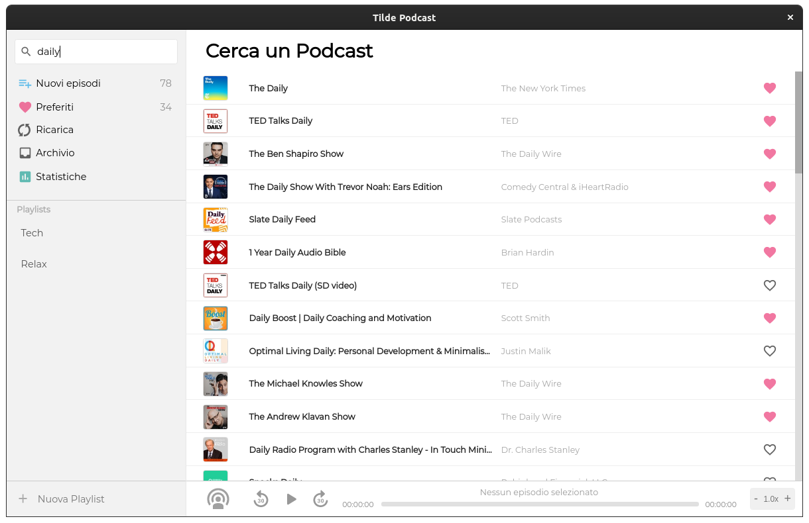

### This project is a fork of [Poddycast](https://github.com/MrChuckomo/poddycast)