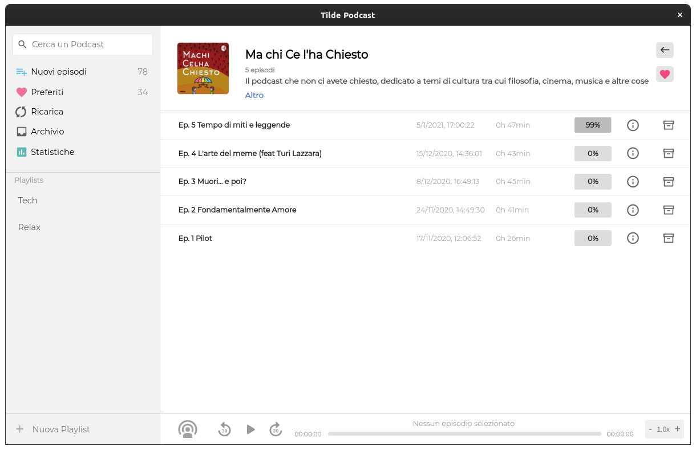
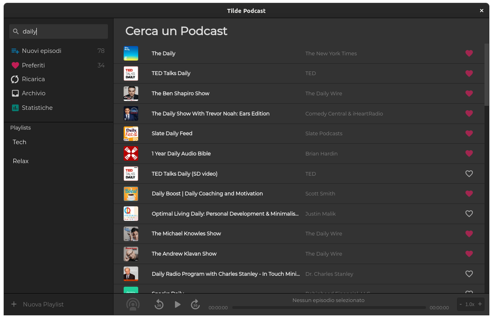

# Tilde
## Podcast client to listen to all you favorite podcasts

  

# New episodes

# Favorites

# Archive

# Statistics

# Show podcasts

# Search for new podcasts via the itunes api

### This project is a fork of [Poddycast](https://github.com/MrChuckomo/poddycast)